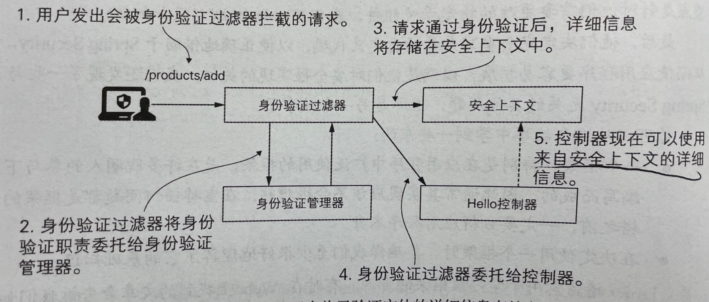
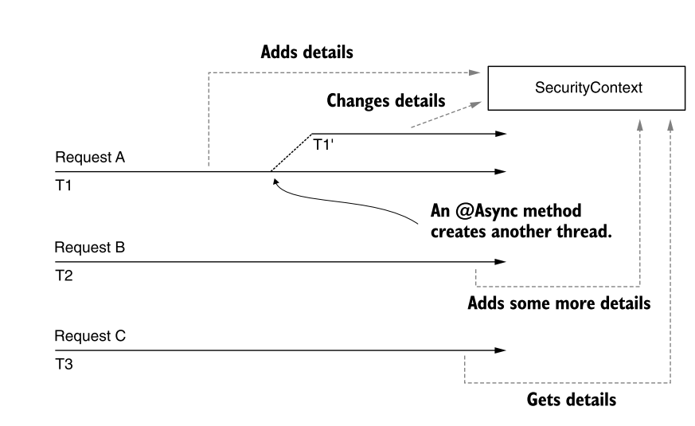
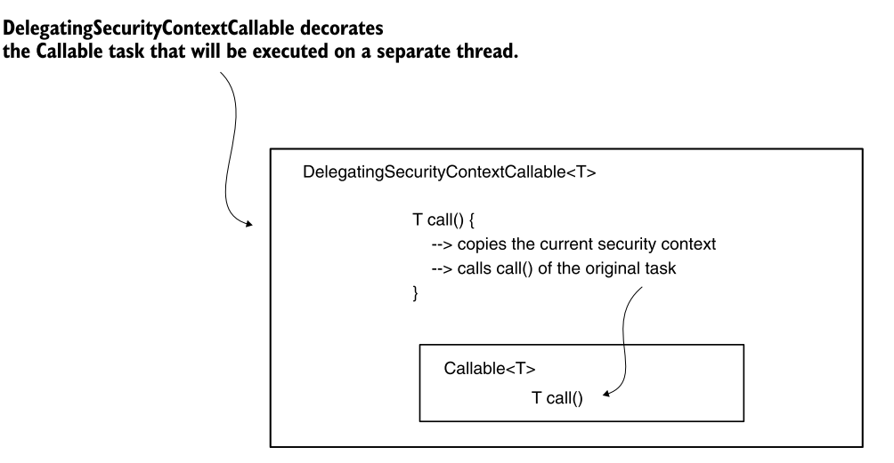
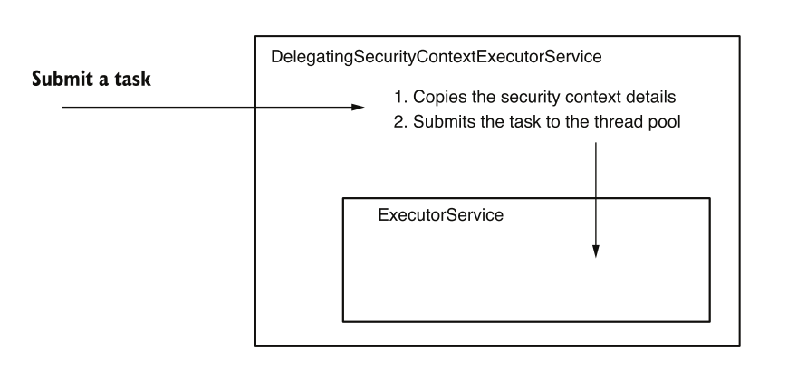

# 认证流程



# SecurityContext

用于存储和设置认证完毕的Authentication对象实例

```java
public interface SecurityContext extends Serializable {
	Authentication getAuthentication(); 
    void setAuthentication(Authentication authentication);
}
```


# SecurityContextHolder

用于获取SecurityContext

```java
SecurityContext context = SecurityContextHolder.getContext();
```


# SecurityContext传播方式

+ MODE_THREADLOCAL：将context存储到ThreadLocal中

+ MODE_INHERITABLETHREADLOCAL：

  + 被@Async标注的方法是会创建一个新的线程执行**（这个线程是Spring感知的）**

  + 如果在MODE_THREADLOCAL模式由于在创建了新的线程中，ThreadLocal不存在对应的context
  + 在MODE_INHERITABLETHREADLOCAL模式下，context会进行传播到新的线程中

+ MODE_GLOBAL：全局线程共享context信息**（不是并发安全的）**，常见用于独立应用（像客户端应用？）

  

## 策略修改方式

```java
@Bean
public InitializingBean initializingBean() { 
	return () -> SecurityContextHolder.setStrategyName(SecurityContextHolder.MODE_GLOBAL);
}
```


# 非Spring感知的线程的context传播

**装饰者模式增强**

## DelegatingSecurityContextRunnable

### 实现原理

创建DelegatingSecurityContextRunnable对象时，会存储原线程的context，并在call的时候**将context复制到新的线程**和并**将原context删除**



## 编码实现

```java
@GetMapping("/ciao") 
public String ciao() throws Exception { 
    Callable<String> task = () -> { 
        SecurityContext context = SecurityContextHolder.getContext(); 
        return context.getAuthentication().getName();
    };
	ExecutorService e = Executors.newCachedThreadPool(); 
    try { 
        var contextTask = new DelegatingSecurityContextCallable<>(task); 
        return "Ciao, " + e.submit(contextTask).get() + "!";
	} finally { 
        e.shutdown();
	} 
}
```

## DelegatingSecurityContextExecutorService

实现原理类似



```java
@GetMapping("/hola") public String hola() throws Exception { 
    Callable<String> task = () -> { 
        SecurityContext context = SecurityContextHolder.getContext(); 
        return context.getAuthentication().getName();
	};
	ExecutorService e = new DelegatingSecurityContextExecutorService(Executors.newCachedThreadPool()); 
    try { 
        return "Hola, " + e.submit(task).get() + "!";
	} finally { 
        e.shutdown();
	} 
}
```

## 其他

+ DelegatingSecurityContextExecutor
+ DelegatingSecurityContextExecutorService
+ DelegatingSecurityContextScheduledExecutorService
+ DelegatingSecurityContextRunnable
+ DelegatingSecurityContextCallable